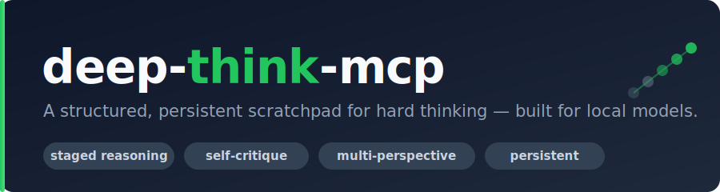

<p align="center">
  
</p>

<p align="center">
  <strong>Give a language model a structured, persistent scratchpad for hard thinking — staged reasoning and self-critique, built for local models.</strong>
</p>

<p align="center">
  <a href="LICENSE"></a>
  
  
  
  
  
  
</p>

<p align="center">
  <a href="#quick-start">Quick Start</a> ·
  <a href="#the-two-modes">Modes</a> ·
  <a href="#configuration">Configuration</a> ·
  <a href="#tool-surface">Tools</a> ·
  <a href="docs/GUIDE.md">Full Guide</a> ·
  <a href="docs/wiring.md">Client Wiring</a>
</p>

---

## The Problem

Ask a capable model a hard question and it will often produce a fluent answer that *sounds* reasoned but skipped the hard parts — it assumed something it never checked, leaned on a weak analogy, ignored a stakeholder, or committed to the first framing that came to mind. The usual fixes ("think step by step," "critique your answer") work unevenly and leave nothing behind: the reasoning evaporates with the context window.

Three concrete gaps:

- **Reasoning is ephemeral.** Once the conversation scrolls away, the chain of thought is gone. You can't revisit *why* a conclusion was reached, or resume a half-finished analysis tomorrow.
- **Self-critique is unstructured.** "Critique yourself" gives a model too much latitude — it critiques what's easiest, not what's load-bearing. Nothing guarantees it stress-tests its evidence, its assumptions, and its blind spots in turn.
- **Local models make both worse.** A 7B/8B model asked to run a multi-step reasoning protocol *and* remember where it is in that protocol *and* emit clean JSON at each step will drop one of those balls.

## The Solution

**deep-think-mcp** is an [MCP](https://modelcontextprotocol.io) server that externalizes the reasoning protocol into a state machine the server runs on the model's behalf. A problem is worked in explicit **stages** (Problem Definition → Research → Analysis → Synthesis → Conclusion), and within each stage the model either sharpens one line of reasoning through rounds of **structured self-critique**, or spins up competing **specialist perspectives** that are scored and converged. Every intermediate step is scored on a shared 7-dimension utility matrix and **saved to disk**.

Because it targets **local models** — small context, weak instruction-following, no reliable JSON mode — every tool response is short, flat, and *directive*: it tells the model exactly which tool to call next. A single tool, `next_action`, answers "what do I do now?" from any state, so the model never has to hold the protocol in its head.

```text
  ┌─ Problem Definition ─┐   ┌─ Analysis ─┐   ┌─ Synthesis ─┐   ┌─ Conclusion ─┐
  │  draft ─▶ critique   │   │  specialist │   │  specialist │   │   commit ─▶  │
  │  ─▶ refine ─▶ score  │ ▶ │  candidates │ ▶ │  candidates │ ▶ │  finalize ─▶ │
  │  ─▶ (converged?) ─▶  │   │  ─▶ score   │   │  ─▶ score   │   │   move/keep  │
  │      commit          │   │  ─▶ winner  │   │  ─▶ winner  │   │              │
  └──────────────────────┘   └─────────────┘   └─────────────┘   └──────────────┘
        every step scored, persisted to disk, and resumable
```

## Features

<table>
<tr>
<td width="50%" valign="top">

### Two reasoning modes, one schema
Every session picks **serial** (one line of reasoning, sharpened by rotating critique lenses) or **subagent** (competing specialist perspectives, scored and converged) — fixed for the life of the session. Both emit the same stage machine, thoughts, and 7-dim utility scores, so you can run a question through both and compare.

### Structured self-critique
Serial mode ships **8 bundled critique lenses** — `overconfidence`, `weak_evidence`, `missing_perspective`, `unstated_assumption`, `scope_creep`, `alternative_framing`, `steel_man`, `first_principles` — each a directive prompt that hunts one specific failure mode. Drop your own `.md` lenses in to add or override by name.

### Persistent by default
One JSON file per session, written under a Portalocker lock with a crash-safe `.bak` protocol, tracked in a central index. Finalize prompts you to **move** the artifact anywhere (a project folder, a synced drive) and it stays fully resumable there.

</td>
<td width="50%" valign="top">

### Built for weak models
Flat tool signatures, short directive responses, and **`next_action`** as an authoritative "what next?" resolver. Every input is accepted as **JSON *or* tolerant plaintext** (`scores="correctness: 0.8, clarity: 0.7"`). Nothing ever raises a traceback — failures return a `retry_with_clarification` directive naming the fix.

### Local-first, offline-capable
Serial mode and the endpoint-free manual subagent engine need **no GPU, no API key, and no network**. Point the optional engines at any OpenAI-compatible endpoint (Ollama, llama.cpp, vLLM) only if you want to.

### Honest hybrid engine
Subagent mode has two engines: `necort` drives a vendored Nash-equilibrium core against an endpoint; `manual` is endpoint-free, where the calling model plays each specialist and self-scores all 7 dimensions for real. (See [the honest NECoRT story](#the-honest-necort-story) — most of the upstream PR turned out to be filler.)

</td>
</tr>
</table>

---

## Quick Start

Requires **Python ≥ 3.11** and [`uv`](https://docs.astral.sh/uv/). The vendored NECoRT core is a git submodule, so clone recursively:

```bash
git clone --recurse-submodules <this-repo-url> deep-think-mcp
cd deep-think-mcp
uv sync                 # core deps; add --extra autopilot for the optional autopilot feature
uv run pytest           # confirm a healthy install (tests never touch your real home dir)
```

(Already cloned without submodules? `git submodule update --init`. The submodule is only needed for `[subagent] engine = "necort"`; everything else works without it.)

**Launch the stdio server:**

```bash
uv run python -m deep_think_mcp.server
```

This is a dev-checkout tool — it reads `config/default.toml` from the repo root, so every client config points `--directory` at your clone (see [`docs/wiring.md`](docs/wiring.md)).

**Drive a serial session** (every response carries a `message` and a `next_tool` — when unsure, call `next_action(session_id)`):

```text
start_session(question="Should we cache API responses at the edge or origin?")
  → { "mode_required": true, "next_tool": "set_session_mode", "session_id": "…" }

set_session_mode(session_id, mode="serial")
begin_thought(session_id, content="Cache at the edge: lower latency for users…")
critique_current_thought(session_id)                       # server picks a stage-appropriate lens
  → { "lens": "weak_evidence", "draft_content": "…", "lens_template": "…", "next_tool": "submit_critique" }
submit_critique(session_id, text="No numbers back the latency claim…")
refine_current_thought(session_id, new_content="Cache at the edge (CDN PoPs) when…")
score_current_thought(session_id, scores="correctness: 0.8, clarity: 0.8, evidence: 0.7, …")
  → { "converged": false, "next_tool": "critique_current_thought" }   # loop until converged or max_rounds
commit_thought(session_id)
advance_stage(session_id)                                   # … repeat through the stages …
finalize_session(session_id)                               # → prompts you to move or keep the saved artifact
```

> **New here?** [`docs/GUIDE.md`](docs/GUIDE.md) is a complete, self-contained teaching document — the concepts, the architecture, both modes in depth, every tool and config key, and how to extend the system. This README is the map; the guide is the tutorial.

---

## The Two Modes

A session's mode is chosen once at creation and is **immutable** — to use the other mode, start a new session. Creating a session *without* a mode returns a `mode_required` directive rather than silently defaulting, forcing the choice to surface.

### Serial — one line of reasoning, critiqued

Within a stage, a thought cycles `begin → critique → submit → refine → score` and repeats with a new lens until it converges. Four convergence rules are checked in precedence order:

1. **`fixed_point`** — the refinement barely changed the text (normalized edit distance `< edit_distance_epsilon`, default `0.05`).
2. **`diminishing_returns`** — two rounds in a row each improved the score by `< score_threshold` (default `0.05`).
3. **`max_rounds`** — the round cap (default `3`) is hit.
4. Otherwise keep going with the next lens.

Natural convergence outranks the ceiling, so you learn *why* it stopped. Lenses rotate through stage-appropriate defaults first (e.g. Analysis → `weak_evidence`, `overconfidence`), then the rest of the library.

### Subagent — competing perspectives, converged

Specialists (default roster: `Analysis`, `Creativity`, `Skeptic`) propose competing candidates scored on the 7-dim matrix; the strongest wins. Two engines, same four tools (`begin_subagent_thought`, `advance_subagent_round`, `inspect_utility_matrix`, `commit_subagent_thought`):

| | `engine = "manual"` (default-safe) | `engine = "necort"` |
|---|---|---|
| **Needs an endpoint?** | No — fully local & offline | Yes — any OpenAI-compatible `/v1` |
| **Who plays the specialists?** | The calling model itself | The vendored Nash core |
| **Utility scoring** | All 7 dims, real self-scores | 3 dims real (`correctness`/`clarity`/`coverage`), 4 neutral `0.5` |
| **Commit gate** | 7-dim mean ≥ `equilibrium_threshold` | winner's `correctness` dim ≥ threshold |
| **Selection** | highest mean wins, ties → earliest | Nash equilibrium |

With `engine = "necort"` but no endpoint configured (the shipped default), `begin_subagent_thought` doesn't fail opaquely — it returns a directive pointing at the endpoint-free manual path.

### The honest NECoRT story

The original design imagined subagent mode as a full port of [PhialsBasement/Chain-of-Recursive-Thoughts PR #7](https://github.com/PhialsBasement/Chain-of-Recursive-Thoughts) — specialist agents, a native 7-dim utility matrix, bias detection, continuous learning. A code recon during the build found that **most of that PR is disconnected filler**: the files advertising those features are never imported, make zero LLM calls, and several aren't even valid Python. The one part that works is `NashEquilibriumRecursiveChat`. So this project **vendors PR #7 in full** (a faithful, re-pinnable submodule mirror) but **imports only those two working files**, wrapped by a single adapter (`necort_adapter.py`) that shims a real crash, a hardcoded endpoint, and a stdout-corrupts-the-transport bug — without editing a vendored line. Because a single blended Nash rating can honestly inform only 3 of 7 dimensions, genuine multi-perspective diversity comes from the second, **from-scratch** manual engine instead. The lesson is baked in: *verify third-party code against reality before building on its advertised behavior.*

---

## Data & the Finalize/Move Lifecycle

Everything lives under one data root, `~/deep-think-mcp/` by default (override with `DEEP_THINK_HOME`):

```
~/deep-think-mcp/
├── config.toml    seeded from config/default.toml on first use; edit freely
├── index.json     session_id → { path, mode, status, created_at, updated_at }
├── sessions/       one JSON file per session
├── lenses/         optional: drop-in .md critique lenses (override by name)
└── logs/           reserved directory (unused in v1)
```

`finalize_session` returns a `human_prompt` offering to relocate the artifact; `move_session` moves it atomically (write → verify → unlink, won't clobber without `force`) and `keep_here` records the decline. Sessions moved *outside* the root stay fully functional — `list_sessions` / `resume_session` find them via the index's absolute paths, and `move_history` tracks every hop.

---

## Configuration

Layered, lowest to highest precedence: **packaged defaults** (`config/default.toml`) → **user config** (`<root>/config.toml`, seeded on first use) → **per-session overrides** (`start_session(overrides={…})`). Key settings:

| Section | Key | Default | Notes |
|---|---|---|---|
| `[store]` | `root` | `"~/deep-think-mcp"` | Overridden by `DEEP_THINK_HOME`, which always wins. |
| `[serial]` | `max_rounds` / `score_threshold` / `edit_distance_epsilon` | `3` / `0.05` / `0.05` | The convergence knobs. |
| `[serial]` | `default_lenses` | the 8 bundled lens names | Rotation order after stage defaults. |
| `[subagent]` | `engine` | `"necort"` | `"necort"` (endpoint) or `"manual"` (endpoint-free). |
| `[subagent]` | `max_rounds` / `equilibrium_threshold` | `2` / `0.75` | Round cap and commit gate. |
| `[subagent]` | `agents` | `["Analysis","Creativity","Skeptic"]` | Specialist roster. |
| `[subagent]` | `endpoint` / `endpoints` / `model` / `api_key` / `timeout` | `""` / `[]` / `"qwen2.5:14b"` / `""` / `120.0` | NECoRT engine target. Empty endpoint → the manual-path directive. |
| `[stages]` | `default` | `["Problem Definition","Research","Analysis","Synthesis","Conclusion"]` | Per-session overridable via `start_session(stages=[…])`. |
| `[autopilot]` | `enabled` / `endpoint` / `model` / `temperature` | `false` / `localhost:11434/v1` / `"qwen2.5:14b"` / `0.7` | Off by default; when off, no network code path is reachable. |

The full table with every key lives in [`docs/GUIDE.md`](docs/GUIDE.md#15-complete-configuration-reference).

**Tolerant input.** Every structured parameter accepts JSON *or* plaintext (`tags="a, b, c"`, `scores="correctness: 0.8, clarity: 0.7"`). Unparseable input returns a `retry_with_clarification` payload naming the parameter, expected shape, and an example — never a raw error.

**Autopilot (optional).** With `[autopilot].enabled = true` (and `uv sync --extra autopilot`), two extra tools let the server drive a whole stage internally against a configured endpoint, stopping cleanly with a resumable partial-progress directive on any fault. Off by default, it imports zero networking code.

---

## Tool Surface

**25 tools always registered; 27 with autopilot enabled.** All responses are flat objects with a `message` and usually a `next_tool`.

| Group | Tools |
|---|---|
| **Session lifecycle** | `start_session` · `set_session_mode` · `list_modes` · `resume_session` · `list_sessions` · `clear_session` · `finalize_session` · `move_session` · `keep_here` |
| **Stage cursor** | `advance_stage` |
| **Serial loop** | `begin_thought` · `critique_current_thought` · `submit_critique` · `refine_current_thought` · `score_current_thought` · `commit_thought` |
| **Subagent loop** | `begin_subagent_thought` · `advance_subagent_round` · `inspect_utility_matrix` · `commit_subagent_thought` |
| **Meta / guidance / I-O** | `next_action` · `summarize_session` · `compress_history` · `export_session` · `import_session` |
| **Autopilot** (when enabled) | `run_stage_autopilot` · `run_subagent_autopilot` |

Full signatures, return fields, and every directive/error code are in [`docs/GUIDE.md`](docs/GUIDE.md#16-complete-tool-reference).

---

## Wiring Into an MCP Client

Copy-pasteable config for **Claude Desktop, Claude Code, Cursor, Continue, and LibreChat** is in [`docs/wiring.md`](docs/wiring.md). The `mcpServers`-style shape:

```json
{
  "mcpServers": {
    "deep-think": {
      "command": "uv",
      "args": ["--directory", "/absolute/path/to/deep-think-mcp", "run", "python", "-m", "deep_think_mcp.server"],
      "env": { "DEEP_THINK_HOME": "/absolute/path/to/your/data-root" }
    }
  }
}
```

---

## Documentation

| Document | What it is |
|---|---|
| [`docs/GUIDE.md`](docs/GUIDE.md) | **The complete teaching guide** — concepts, architecture, both modes in depth, full tool/config/directive/data-model references, extension, FAQ, glossary. |
| [`docs/wiring.md`](docs/wiring.md) | Exact client config for Claude Desktop, Claude Code, Cursor, Continue, LibreChat. |
| [`docs/build-plan.md`](docs/build-plan.md) | The original design document (the "why" behind the architecture). |
| [`docs/execution-plan.md`](docs/execution-plan.md) | The task-by-task build breakdown with global constraints. |
| [`docs/necort_deps.md`](docs/necort_deps.md) | Why `requests`/`numpy`/`openai` are dependencies of a project that never calls the OpenAI SDK. |
| [`docs/repinning_necort.md`](docs/repinning_necort.md) | How to re-pin the vendored NECoRT submodule. |

---

## Architecture

The system is layered: a **dispatch layer** (`server.py`) that registers the tools, gates wrong-mode calls, parses tolerant input, and turns storage faults into directives; the **engines** (`serial_engine`, `subagent_engine`, `manual_engine`, `necort_adapter`, optional `autopilot`) that do the thinking; and a **domain + persistence** layer (`session`, `stages`, `lens_loader`, `store`, `index`, `lifecycle`, `config`, `prompts`, `tolerant`). Two invariants hold the design together: **all model-facing wording lives in `prompts.py`**, and **`necort_adapter.py` is the only file that imports vendored code** — the entire third-party surface is quarantined behind one boundary. Full diagram in the [guide](docs/GUIDE.md#6-architecture-the-seven-layers).

---

## Testing

```bash
uv run pytest            # full suite (423 tests)
uv run pytest -q -W error   # the CI bar: pristine, warnings are errors
```

The suite drives the **real MCP SDK's in-memory client against the real server** for every tool contract, plus one subprocess test that speaks real stdio MCP to the launched server. Every test injects a `tmp_path` data root, so running the suite never touches your real home directory.

**How it was built.** Implemented task-by-task with a fresh-implementer → adversarial spec+quality review → fix-loop discipline, closed out by a whole-branch multi-lens review with adversarial verification of every finding (including two real security fixes: import path traversal and credential exfiltration). Design docs are [`docs/build-plan.md`](docs/build-plan.md) and [`docs/execution-plan.md`](docs/execution-plan.md).

## Benchmarks

Not yet run. A head-to-head of serial vs. subagent on three canonical prompts is planned but requires blind human rating to be meaningful, and is deliberately deferred rather than shipped as a self-graded number.

## License

MIT — see [`LICENSE`](LICENSE). This project vendors third-party source code (`vendor/necort/`, a git submodule of [PhialsBasement/Chain-of-Recursive-Thoughts](https://github.com/PhialsBasement/Chain-of-Recursive-Thoughts) PR #7) under its own MIT license; see [`LICENSE-NOTICES`](LICENSE-NOTICES) for full attribution.
